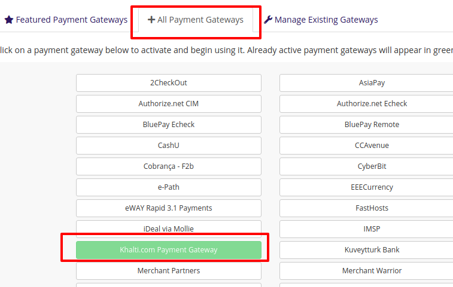
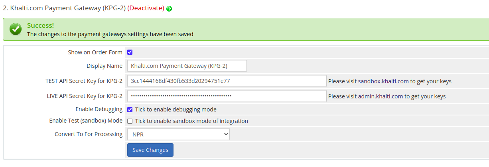

# Khalti Payment Gateway
Official plugin for WHMCS

## Installation
1. Download the ZIP (or tar.gz) file from the releases [See the releases](https://github.com/khalti/whmcs-khaltigateway-plugin/releases)
2. Extract at the root folder of your WHMCS installation. Following files will be copied

## File Structure
```
├── modules
│   └── gateways
│       ├── callback
│       │   └── khaltigateway.php
│       ├── khaltigateway
│       │   ├── assets
│       │   │   ├── configure_epay.png
│       │   │   └── enable.png
│       │   ├── callback.php
│       │   ├── checkout.php
│       │   ├── init.php
│       │   ├── khalti_helpers.php
│       │   ├── templates
│       │   │   ├── initiate_failed.html
│       │   │   ├── invalid_currency.html
│       │   │   ├── invoice_payment_button.php
│       │   │   └── noninvoice_page.html
│       │   ├── utils.php
│       │   └── whmcs.php
│       └── khaltigateway.php   
```
   (The plugin creates 
   - file khaltigateway.php under modules/gateways directory of your root installation,
   - directory khaltigateway/ under modules/gateways directory of your root installation
   - file khaltigateway.php under modules/gateways/callback directory of your root installation. (This file is kept just to maintain the WHMCS convention)
   
## Activate
Login to admin area of your WHMCS installation and enable the gateway from 
``Setup -> Payments -> Payment Gateways``
(Refer to the image below)


## Configure
Once the gateway is enabled, configure Khalti Payment Gateway with the merchant secrets from [admin.khalti.com](https://admin.khalti.com/)
(Refer to the image below)


PS: Please make sure that the currency "NPR" is selected for the option "Convert to For Processing"
PS: Please make sure that Refund Works only in Live mode.
