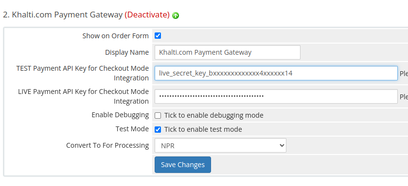

# Khalti Payment Gateway
Official plugin for WHMCS

## Installation
1. Download the ZIP (or tar.gz) file from the releases [See the releases](https://github.com/khalti/whmcs-khaltigateway-plugin/releases)
2. Simply extract at the root folder of your WHMCS installation. Following files will be copied
  - | modules / 
    -   | gateways / 
       -   | khaltigateway.php
       -   | khaltigateway / 
          -    | common.php
          -    | index.php
          -    | init.php
          -    | step2.php
       -   | callback / 
          -    | khaltigateway.php
   (Basically, the plugin creates 
   - file khaltigateway.php under modules/gateways directory of your root installation,
   - directory khaltigateway/ under modules/gateways directory of your root installation
   - file khaltigateway.php under modules/gateways/callback directory of your root installation. (This file is kept just to maintain the convention that WHMCS suggests)
3. Login to admin area of your WHMCS installation and enable the gateway from ``Setup -> Payments -> Payment Gateways``
(Refer to the image below)

4. Once the gateway is enabled, the gateway parameters need to be configured.
(Refer to the image below)

